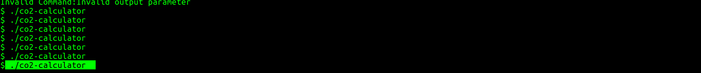

# Co2Emission-Calculator

One Paragraph of project description goes here

## Getting Started

Task is to create a program that returns the amount of CO2-equivalent that will be caused when traveling a given distance using a
given transportation method.

### Prerequisites
To Execute this Application JAVA should be pre-installed in the System,
to install java follow these  [link](https://www.java.com/en/download/help/download_options.html)

Check Whether java installed or not with fallowing command.
```
java -version
```

### Installation
1.Download the project .zip file from  [Project Files](https://sap-my.sharepoint.com/:f:/p/alexander_thierfelder/Erb_I5-3YjBBiHfKq7qOUt0BhDrsJG5g5IPaY8isilJ44A)
and Extract the Project files to Deskotp.


2.Open Terminal and Navigate to source folder
```
cd Desktop/Co2Emission/src
```


## Compile and Run
We have two java class/Files 1.class Transportation ie Transportation.java and 2.class Co2Emission.  ie Co2Emission.java...
We neeed to compile both the Files and Run the Main Class ie class Co2Emmision.
```
javac Transportation.java
javac Co2Emission.java
java Co2Emission
```


## Execution and Testing

The tool can be called with a numeric distance , a unit-of-distance (kilometer km or meter m ) and a transportation-
method.
Named parameters can be put in any order and either use a space ( ) or equal sign ( = ) between key and value.

## Test Scenario-1:

```
$ ./co2-calculator --transportation-method medium-diesel-car --distance 15 --unit-of-distance km

```
### Output-1:


## Test Scenario-2:

```
$ ./co2-calculator --distance 1800.5 --transportation-method large-petrol-car

```
### Output-2:


## Test Scenario-3:the amount of CO2-equivalent in kilogram kg or gram g.

```
$ ./co2-calculator --transportation-method train --distance 14500 --unit-of-distance m

```
### Output-3a:the amount of CO2-equivalent in gram g.


```
$ ./co2-calculator --transportation-method train --distance 14500 --unit-of-distance m --output kg

```
### Output-3b:the amount of CO2-equivalent in kg.


## Test Scenario-4:Named parameters can be put in any order and either use a space ( ) or equal sign ( = ) between key and value.

```
$ ./co2-calculator --unit-of-distance=km --distance 15 --transportation-method=medium-diesel-car

```
### Output-4:


## Test Scenario-5:when Non-Existing trasportation-method value is Passed.

```
$ ./co2-calculator --transportation-method flight --distance 15 --unit-of-distance km

```
### Output-5:Invalid Command: transportation-method not exist


## Test Scenario-6:when Non-numeric distance value is Passed.

```
$ ./co2-calculator --transportation-method train --distance dhgd --unit-of-distance km

```
### Output-6:Invalid Command: Non-Number value passed for distance


## Test Scenario-7:when Invalid unit-of-distance value Passed.

```
$ ./co2-calculator --transportation-method train --distance 15 --unit-of-distance kg

```
### Output-7:Invalid Command:Invalid unit-of-distance parameter


## Test Scenario-8:when Invalid ouput value is Passed.

```
$ ./co2-calculator --transportation-method train --distance 15 --unit-of-distance km --output km

```
### Output-8:Invalid Command: Invalid Command:Invalid output parameter


## Test Scenario-9:When Empty.

```
$ ./co2-calculator 

```
### Output-9:It asks again for Parameter Parsing (I Wrote Custom CLI Script to handle Empty Condition).



## Author

 **BHEEMASHANKAR JAKKANI**
